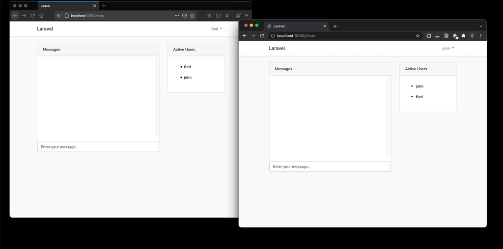

# Laravel chat



## インストール

docker コンテナ起動

```
$ docker-compose up -d
```

依存ライブラリインストール

```
$ docker-compoe exec workspace bash
# composer install
```

アプリケーション初期設定

```
# cp .env.example .env
# php artisan key:generate
# php artisan migrate
```

サンプルデータ挿入

```
# php artisan db:seed
```
